<center><h1> SQ-391 WRO 2025 </center>
<p align="center">
  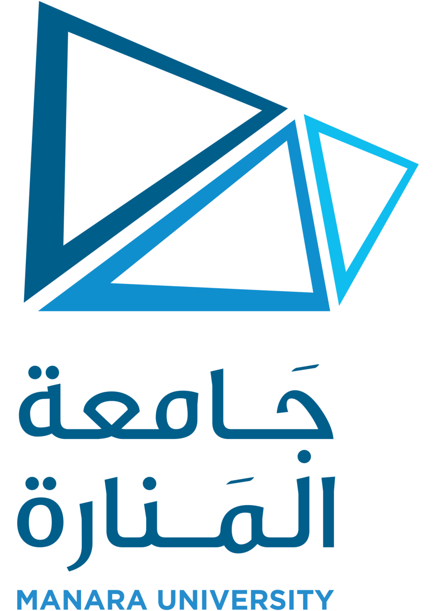
</p>

<p align="center">
  <a href="https://manara.edu.sy/index.php?lang=1">
    
  </a>
  <a href="https://www.facebook.com/share/1FbUMCjNEs/">
    
  </a>
  <a href="https://www.instagram.com/manarauni?igsh=OWlpZjd6Nm52ZmV3">
    
  </a>
</p>


This repository contains the documentation for the SQ-391 team's robot for the 2025 World Robot Olympiad Future Engineers competition. The robot was designed and built by a team of three students and one coach.

## Table of Contents

- [The Team](#team)
- [The Challenge](#challenge)
- [The Robot](#robot-image)
- [Performance Video](#video)
- [Mobility Management](#mobility-management)
  - [Vehicle Main Body](#vehicle-main-body)
    - [3D Designed Parts](#3d-designed-parts)
  - [Motion Mechanism](#motion-mechanism)
    - [Ackermann Steering Mechanism](#ackermann-steering-mechanism)
    - [Differential Gear](#differential-gear)
    - [Motor Driver](#motor-driver)
  - [Wheels](#wheels)
  - [Engineering Principles](#engineering-principles)
- [Power and Sense Management](#power-and-sense-management)
  - [Electronic Parts](#electronic-parts)
  - [Overall Circuit Usage](#overall-circuit-usage)
  - [Circuit Grounding](#circuit-grounding)
  - [Power Supply](#power-supply)
  - [Overall Scheme](#overall-scheme)
  - [Wiring Diagram](#wiring-diagram)
  - [Assembly List](#assembly-list)
  - [Shopping List](#shopping-list)
- [Obstacle Management](#obstacle-management)
  - [ROS Architecture](#ros-architecture)
  - [Open Challenge](#open-challenge)
  - [Image Processing](#image-processing)
  - [Obstacle Challenge](#obstacle-challenge)
  - [Problems We Encountered](#problems-we-encountered)
- [Suggestions and Future Modifications](#suggestions-and-future-modifications)
- [Resources](#resources)

---

## The Team <a class="anchor" id="team"></a>

### Alhadi Zidan

<p align="center">
  
</p>

**Role:** Coach

**Age:** 22

**Description:** Robotics and Intelligent Systems Engineer - AlManara University.

---

### Ammar Daher

<p align="center">
  
</p>

**Age:** 21

**Description:** Robotics and Intelligent Systems student at AlManara University (fifth year).

---

### Lama Alsakher

<p align="center">
  
</p>

**Age:** 20

**Description:** Robotics and Intelligent Systems student at AlManara University (third year).

---

### Ibrahim Alsheikh

<p align="center">
  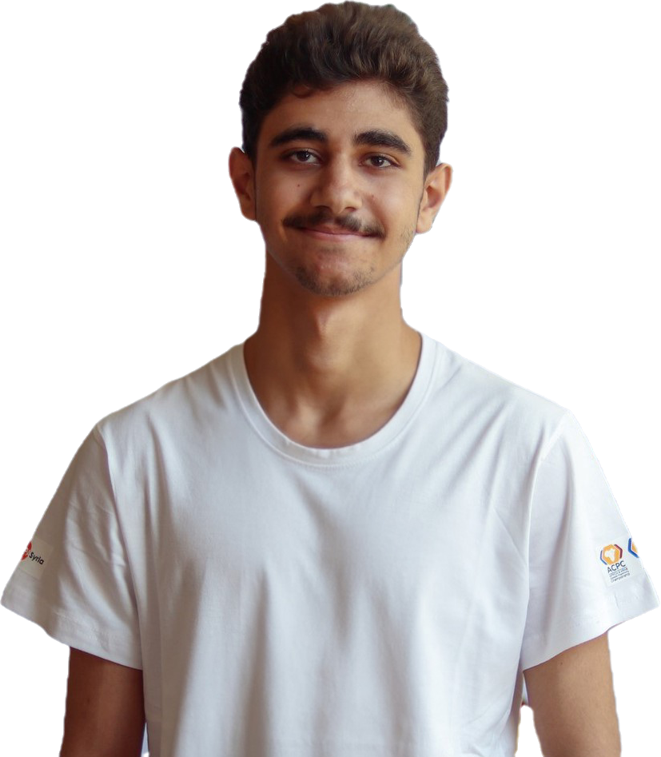
</p>

**Age:** 20

**Description:** Robotics and Intelligent Systems student at AlManara University (third year).

---

### Team photo

<p align="center">
  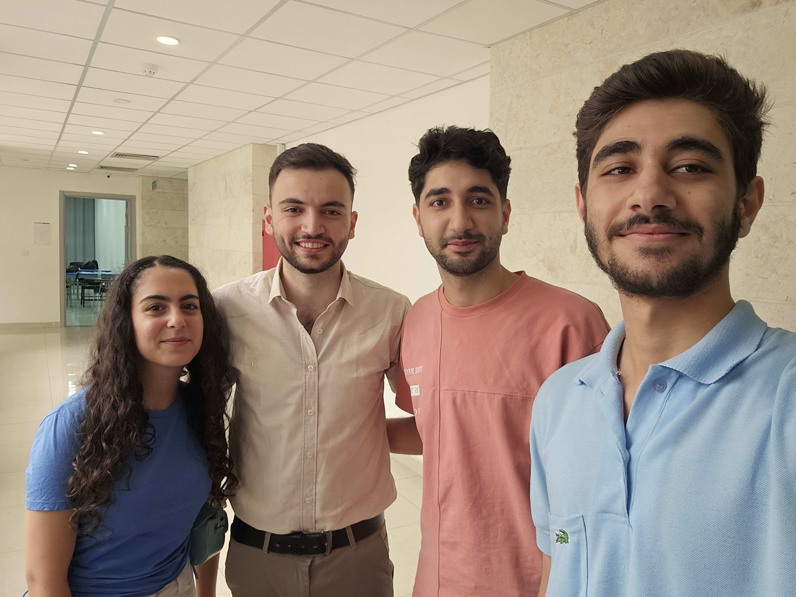
</p>

## The Challenge <a class="anchor" id="challenge"></a>

The **[WRO 2025 Future Engineers - Self-Driving Cars](https://wro-association.org/)** challenge invites teams to design, build, and program a robotic vehicle capable of driving autonomously on a racetrack that changes dynamically for each round. The competition includes two main tasks: completing laps while navigating randomized obstacles and successfully performing a precise parallel parking maneuver.

Our approach emphasizes:

- **Advanced Navigation:** Using ROS (Robot Operating System) for real-time sensor fusion and control
- **Computer Vision:** HSV-based color detection for pillar identification
- **Precision Mechanics:** Ackermann steering geometry for optimal maneuverability
- **Robust Engineering:** Systematic approach to power management and component integration

Learn more about the challenge [here](https://wro-association.org/wp-content/uploads/WRO-2025-Future-Engineers-Self-Driving-Cars-General-Rules.pdf).

## Photos of our robot <a class="anchor" id="robot-image"></a>

| 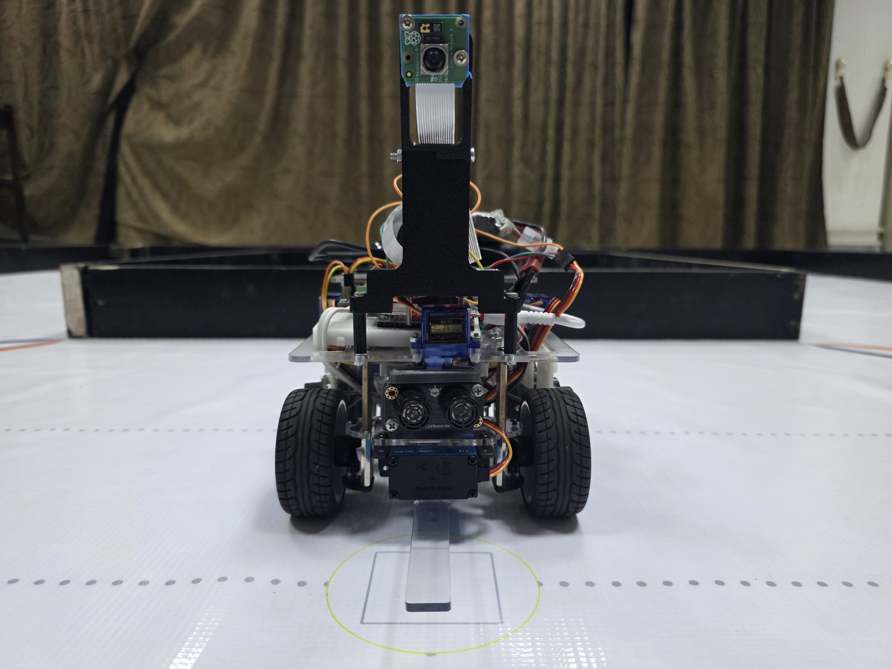 |  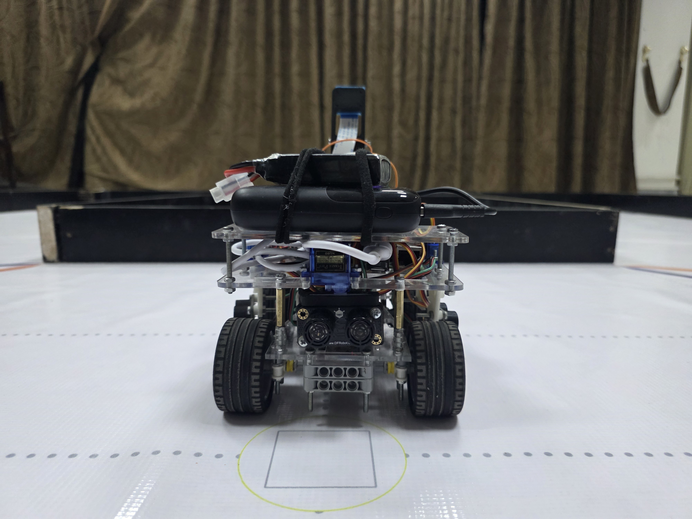  |
| :------------------------------------------------: | :-------------------------------------------------: |
|                      _Front_                       |                       _Back_                        |
| 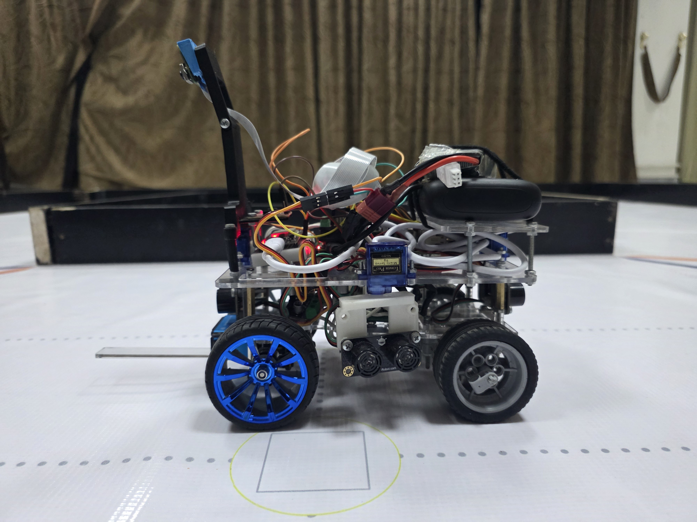  | 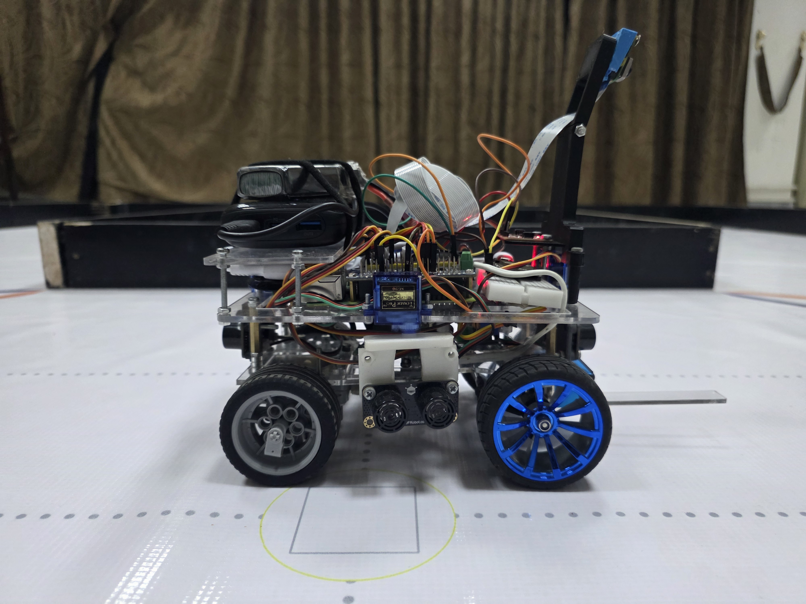  |
|                       _Left_                       |                       _Right_                       |
|  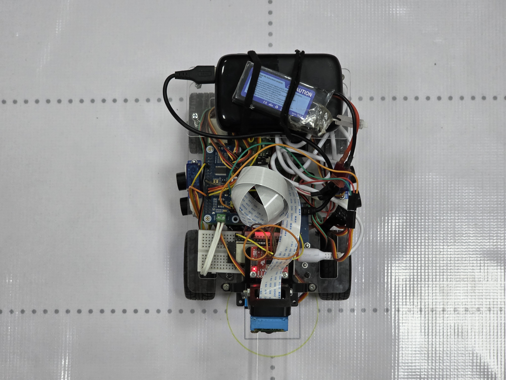  | 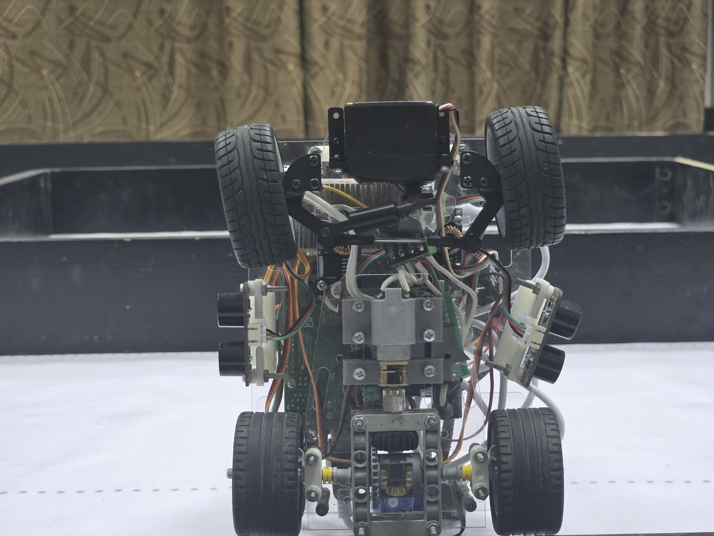 |
|                       _Top_                        |                      _Bottom_                       |

<br>

## Our video of the robot <a class="anchor" id="video"></a>

<br>
See the <a href='https://youtu.be/4KCWDdZQ504'> Open Challenge <a/> and the <a href='https://youtu.be/md53USKwSMA'> Obstacle Challenge <a/>


# Mobility Management <a class="anchor" id="mobility-management"></a>

## Vehicle Main Body <a class="anchor" id="vehicle-main-body"></a>

Our robot is a four-wheeled vehicle constructed from two layers of Plexiglass. The upper layer accommodates the primary control and processing units, including the microprocessors, controllers, actuators, and the camera. The lower layer is dedicated to the navigation system and electrical circuit. Sensors and camera are placed in specific positions to detect the surrounding environment.

### 3D Designed Parts <a class="anchor" id="3d-designed-parts"></a>

All components were designed using SOLIDWORKS. The structural parts (base and upper layer) were precision-cut using a CNC laser machine, while functional components were 3D-printed in PLA.

#### Base Layer

A structural base layer that provides mounting for the Ackermann steering and differential mechanisms on its bottom face and hosts the electronic circuit assembly on its top face.

#### Upper Layer

A structural layer that provides mounting for DC-DC converters on its underside and accommodates the Raspberry Pi, ESP, power bank, and camera assembly on its top surface. It also holds servo motors that rotate ultrasonic sensors.

#### Custom 3D-Printed Components

- **Lego-axle to DC motor axle coupler** - High precision interface connecting DC motor shaft to Lego axle.
- **Ultrasonic Sensor Holder** - Secures ultrasonic sensors to servo motors for directional scanning.
- **Camera Holder** - Two-part assembly with integrated IMU mounting.
- **DC Motor Holder** - Rigid mount that fixes the motor to the robot’s structure.
- **Support Wall** - Structural connector between chassis layers.

## Motion Mechanism <a class="anchor" id="motion-mechanism"></a>

### Ackermann Steering Mechanism <a class="anchor" id="ackermann-steering-mechanism"></a>

Our design incorporates an Ackermann steering mechanism for efficient and responsive steering performance. This setup improves handling during turns and helps reduce tire wear by ensuring that each wheel follows its proper path around a corner. The inner wheel turns at a sharper angle than the outer one, allowing the robot to turn more naturally and maintain better traction.

**Key Mathematical Relations:**

For wheelbase L, front track t, and turn radius R, the ideal relations are:

```
tan(δ_in) = L/(R - t/2)
tan(δ_out) = L/(R + t/2)
```

**Steering Ratio:** The relationship between servo input angle and resulting road-wheel angle:

```
SR = θ_input / δ_avg
δ_avg ≈ θ_input / SR
```

**Servo Torque:** Required actuator torque:

If M_req is the required steering moment at the road-wheel side, η is the mechanism efficiency (typically 0 <η ≤ 1), then:

```
τ_servo ≈ M_req / (SR × η)
```

**Turning Radius:**

```
R ≈ L / tan(δ_avg)
```

### Differential Gear <a class="anchor" id="differential-gear"></a>

We implemented a Lego differential gear system that ensures rear wheels can spin at different rates while maintaining balanced power distribution. This component plays a crucial role in maintaining smooth and controlled movement, particularly when the robot is turning or when one wheel has less traction than the other. By balancing the torque between both wheels, the differential gear helps prevent skidding and ensures stable movement.

**Components:**

- Ring Gear: Large gear receiving power from the motor
- Pinion Gear: Smaller gear connecting to the drive shaft
- Side Gears: Two gears linking the differential to the axle shafts
- Spider Gears: Allow wheels to rotate at varying speeds

**Gear Ratio Calculation:**

```
GR = R/S1 + R/S
```

Where R is ring gear teeth, S1 and S2 are side gear teeth.

The wheel speed (N_wheel) can be derived from the motor’s no-load speed (N_Motor_no_load) using the formula:

```
N_wheel = N_Motor_no_load / GR
```

### Motor Driver <a class="anchor" id="motor-driver"></a>

The DRV8871 H-bridge motor driver provides:

- **Current Capability:** Up to 3.5A continuous, 3.6A peak
- **Voltage Range:** 6.5-45V input
- **PWM Control:** 0-200kHz recommended frequency
- **Protection:** Overcurrent, thermal shutdown, undervoltage lockout
- **Control:** Simple two-pin interface (IN1, IN2)

## Wheels <a class="anchor" id="wheels"></a>

**Specifications:**

- **Diameter:** 65mm
- **Width:** 25-30mm
- **Material:** Rubber tire with plastic hub
- **Weight:** Lightweight for optimal performance (20-21 g)
- **Coupling:** Compatible with hex connections

## Engineering Principles <a class="anchor" id="engineering-principles"></a>

1. **Torque and Speed Balance:** Motor selection based on τ = F × r relationship
2. **Power Output:** Verification using P = τ × ω, providing 4.2W sufficient power
3. **Weight Distribution:** Strategic component placement for stability
4. **Maneuverability:** Differential drive system with ~0.1m turning radius
5. **Energy Efficiency:** Optimized gear ratios for peak efficiency operation

# Power and Sense Management <a class="anchor" id="power-and-sense-management"></a>

## Electronic Parts <a class="anchor" id="electronic-parts"></a>

### ESP32-WROOM-32E

| **Feature** | **Details / Image** |
|--------------|--------------------|
| **Core** | Dual-core Xtensa® LX6 up to 240 MHz |
| **Memory** | 520 KB SRAM, 4 / 8 / 16 MB QSPI flash, optional 2 MB PSRAM |
| **Wireless** | Wi-Fi 802.11 b/g/n (2.4 GHz), Bluetooth 4.2 + BLE |
| **I/O** | Up to 26 GPIOs (3.3 V), 2× 12-bit ADC, 2× 8-bit DAC, 10 touch inputs |
| **Interfaces** | UART × 3, SPI × 4, I²C × 2, I²S, PWM, CAN (TWAI), SD/MMC, Ethernet MAC |
| **Supply** | 3.0 – 3.6 V (typ. 3.3 V), ≥ 500 mA recommended |
| **Operating Temp** | −40 °C to 85 °C (105 °C for H variants) |
| **Programming** | UART-based flashing via CP2102 / CH340 bridge |
| **Form Factor** | 18 × 25.5 × 3.1 mm, 38 castellated pads |
| **Image** | <div align="center">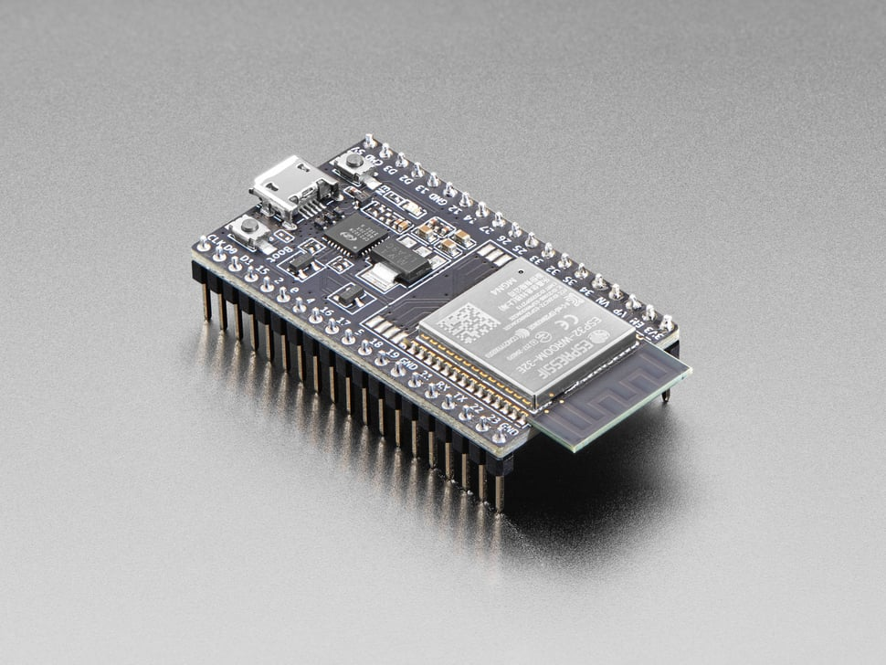 |

### Raspberry Pi 4 Model B

| **Feature** | **Details / Image** |
|--------------|--------------------|
| **Processor** | Broadcom BCM2711, quad-core Cortex-A72 (ARM v8) 64-bit SoC @ 1.5 GHz |
| **Memory** | Up to 8 GB LPDDR4 RAM |
| **Connectivity** | Dual-band Wi-Fi (2.4/5.0 GHz 802.11b/g/n/ac), Bluetooth 5.0 + BLE, Gigabit Ethernet |
| **USB Ports** | 2 × USB 3.0, 2 × USB 2.0 |
| **GPIO** | 40-pin header (backward-compatible with earlier boards) |
| **Video & Sound** | 2 × micro HDMI (up to 4Kp60), MIPI DSI/CSI, 4-pole audio + video jack |
| **Multimedia** | H.265 4Kp60 decode, H.264 1080p60 decode / 1080p30 encode, OpenGL ES 3.0 |
| **Storage** | Micro SD card slot for OS and data |
| **Power Input** | 5 V DC via USB-C (≥ 3 A) or GPIO header; PoE supported (via PoE HAT) |
| **Environment** | Operating temperature 0–50 °C; in production until ≥ 2034 |
| **Image** | <div align="center">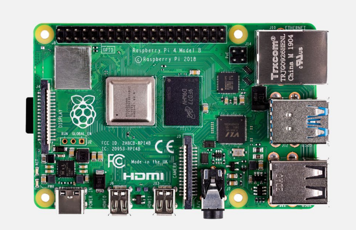 |

### Raspberry Pi Camera Module 3

| **Feature** | **Details / Image** |
|--------------|--------------------|
| **Sensor** | Sony IMX708, 11.9 MP, 4608 × 2592 px (1/2.43″ optical size) |
| **Pixel Size** | 1.4 µm × 1.4 µm |
| **Focus** | Motorized, depth of field ≈ 5 cm – ∞ |
| **Focal Length** | 2.75 mm, F / 2.2 |
| **Field of View** | 102° (H) × 67° (V) |
| **Max Exposure** | 112 s |
| **Video Modes** | 2304 × 1296 @ 56 fps, 2304 × 1296 @ 30 HDR, 1536 × 864 @ 120 fps |
| **Size / Weight** | 25 × 24 × 12.4 mm; ≈ 4 g |
| **NoIR Version** | Unavailable |
| **Interface** | CSI connector (Raspberry Pi compatible) |
| **Image** | <div align="center"></div> |


### BN0086 (Qwiic) IMU Sensor

| **Feature** | **Details / Image** |
|--------------|--------------------|
| **Type** | 9-DoF IMU – 3-axis accelerometer, 3-axis gyroscope, 3-axis magnetometer |
| **Sensor Fusion** | On-chip Cortex-M0+ running SH-2 firmware (quaternion + rotation vector output) |
| **Interfaces** | I²C (Qwiic, 3.3 V logic, up to 400 kHz), SPI, UART |
| **I²C Address** | 0x4B (default), optional 0x4A via solder jumper |
| **Output Data** | Rotation Vector (9-axis), Game Rotation (6-axis), Linear Accel, Gravity, Raw Sensor Data |
| **Supply Voltage** | 3.3 V (Qwiic connector) |
| **Interrupt** | INT pin for event-driven reporting; configurable update rate (tens–hundreds Hz) |
| **Calibration** | Auto gyro/accel bias; magnetometer requires hard/soft-iron calibration |
| **Mounting** | Align IMU frame (X,Y,Z) with robot frame; minimize vibration and magnetic interference |
| **Use Case** | Absolute and relative orientation tracking for robotics, mapping, and navigation |
| **Image** | <div align="center">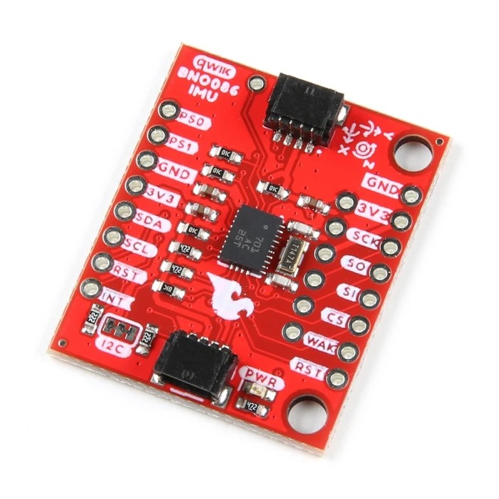</div> |

### DRV8871 Motor Driver

| **Feature** | **Details / Image** |
|--------------|--------------------|
| **Type** | Single H-bridge brushed DC motor driver (Texas Instruments) |
| **Topology** | Full H-bridge using 4 N-MOSFETs; R<sub>DS(on)</sub> ≈ 565 mΩ |
| **Current Capability** | Up to 3.5 A continuous, 3.6 A peak |
| **Supply Voltage (VM)** | 6.5 – 45 V |
| **Control Inputs** | IN1 / IN2 logic pins (forward, reverse, brake, coast) |
| **Logic Levels** | 0 – 5.5 V; internal pulldowns ≈ 100 kΩ |
| **PWM Control** | 0 – 200 kHz; effective duty range ≈ 16 – 84 |
| **Current Regulation** | Integrated sensing; programmable limit via ILIM resistor |
| **Protections** | UVLO, overcurrent (OCP ≈ 3.7 – 6.4 A), thermal shutdown (TSD) |
| **Package** | 8-pin HSOP (DDA) with PowerPAD™ (≈ 4.9 × 6.0 mm) — tie pad to GND plane |
| **Image** | <div align="center">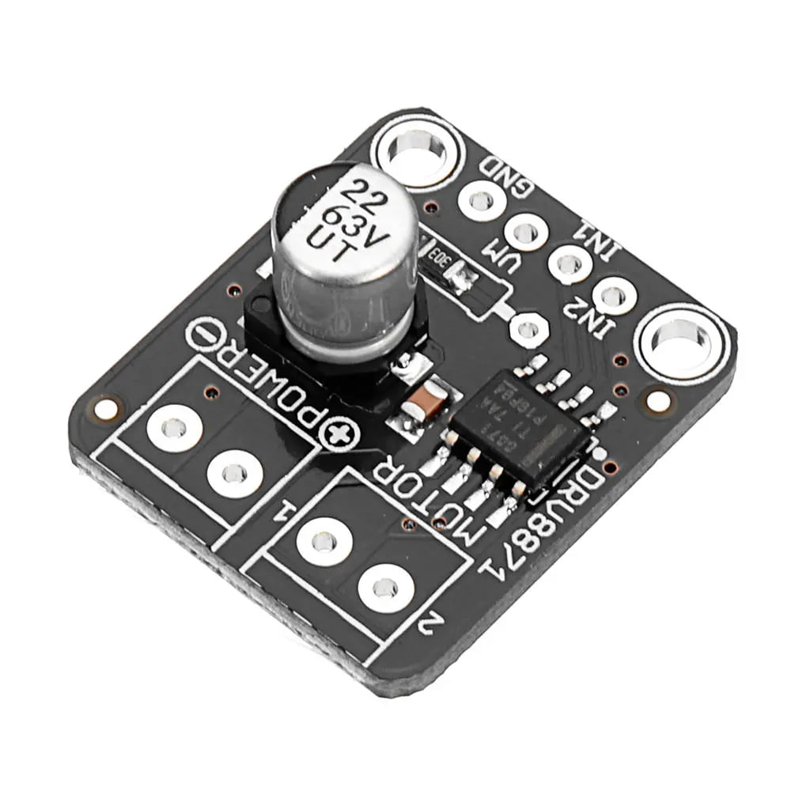</div> |


### URM09 Ultrasonic (Trig)

| **Feature** | **Details / Image** |
|--------------|--------------------|
| **Type** | Ultrasonic distance sensor (single-wire Trig/Echo via TDM) |
| **Range** | 2 – 500 cm |
| **Resolution** | 1 cm; Accuracy ≈ 1 |
| **Measurement Rate** | Up to 25 Hz (Trig variant) |
| **Interface** | Single digital I/O (Trig + Echo multiplexed) |
| **Timing** | 10 µs trigger pulse; max echo ≈ 35 ms |
| **Supply Voltage** | 3.3 – 5.5 V; Current < 20 mA |
| **Field of View** | ≈ 60° beam angle |
| **Size** | 47 × 22 mm (3-pin PH2.0 connector: +, –, D) |
| **Integration Notes** | Fire one sensor at a time; wait > 40 ms between pings to avoid cross-talk |
| **Image** | <div align="center">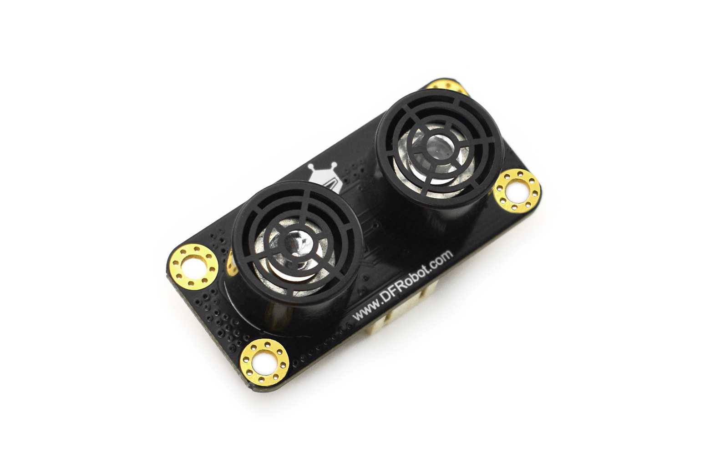</div> |

### Core DC Motor (6 V, 400 RPM)

| **Feature** | **Details / Image** |
|--------------|--------------------|
| **Type** | Brushed DC motor with metal gearbox (carbon brushes) |
| **Nominal Voltage** | 6 V DC |
| **Gear Ratio** | 48 : 1 |
| **No-Load Speed** | ≈ 400 RPM ; No-Load Current ≈ 120 mA |
| **Torque** | Continuous ≈ 1.2 kg·cm (0.118 N·m), Stall ≈ 3.9 kg·cm (0.382 N·m) |
| **Stall Current** | ≈ 3.2 A |
| **Mechanical** | Size ≈ 47 × 15 × 10 mm ; Weight ≈ 21 g ; 3 mm D-shaft (8 mm L) |
| **Recommended Driver** | H-bridge ≥ 3.2 A peak, PWM speed control (tens kHz range) |
| **Notes** | Operable up to 15 V (short duration) ; avoid stall for thermal safety |
| **Image** | <div align="center">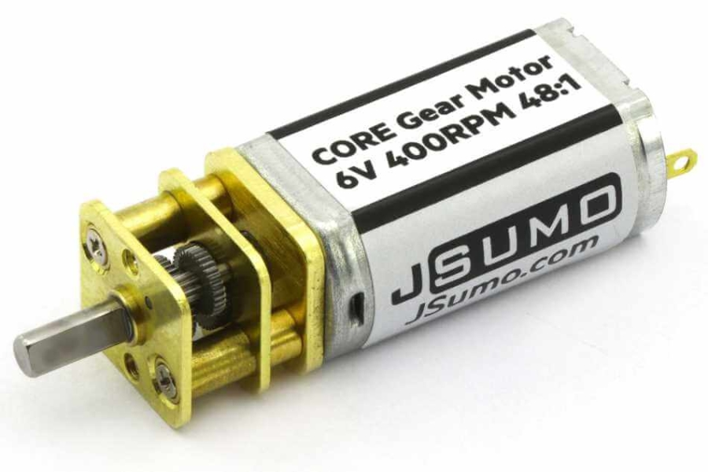</div> |


### TowerPro MG996R Servo

| **Feature** | **Details / Image** |
|--------------|--------------------|
| **Type** | High-torque, metal-gear hobby servo |
| **Operating Voltage** | 4.8 V – 7.2 V |
| **Stall Torque** | 12 kg·cm (at 6 V) |
| **Speed** | 0.2 s / 60° (at 6 V) |
| **Control Signal** | Standard PWM (1 – 2 ms pulse width) |
| **Gear Type** | All-metal gears for durability and strength |
| **Dimensions** | 40.7 × 19.7 × 42.9 mm ; Weight ≈ 55 g |
| **Connector** | JR (universal 3-pin type) |
| **Image** | <div align="center">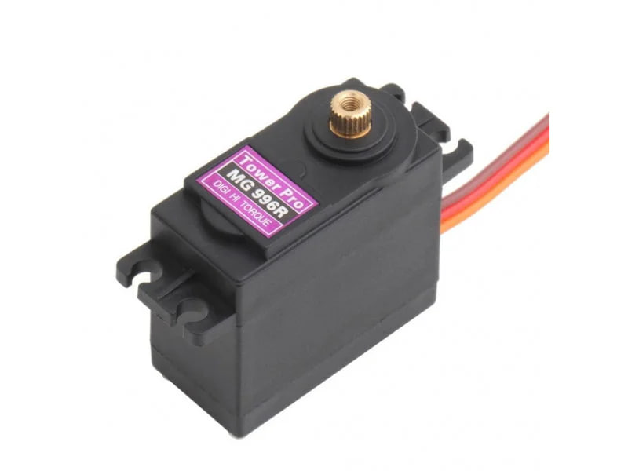</div> |

### Micro Servo Motor SG90

| **Feature** | **Details / Image** |
|--------------|--------------------|
| **Type** | 9 g micro servo with plastic gears and PWM control |
| **Operating Voltage** | 4.8 – 6.0 V (nominal 5 V) |
| **Rotation Range** | ≈ 180° mechanical (160–170° usable via PWM) |
| **Speed** | ≈ 0.12 s / 60° at 4.8 V |
| **Torque** | ≈ 1.8 kg·cm (0.176 N·m) at 4.8 V |
| **Current Draw** | 10–15 mA idle, 100–250 mA typical, ≥ 650 mA stall |
| **Dimensions** | 22.8 × 12.2 × 29.4 mm ; Weight ≈ 9 g |
| **Control Signal** | 50 Hz PWM (1.0–2.0 ms pulse width, 1.5 ms center) |
| **Mounting** | Includes horns and screws; Futaba-compatible 21T spline (4.8 mm) |
| **Image** | <div align="center">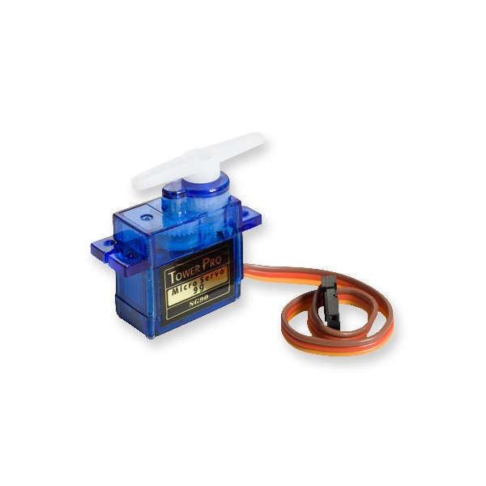</div> |

### PCA9685 Servo Driver HAT

| **Feature** | **Details / Image** |
|--------------|--------------------|
| **Controller** | PCA9685 – 16-channel, 12-bit PWM generator with I²C interface |
| **PWM Frequency** | Programmable 24 Hz – 1.5 kHz ; use 50–60 Hz for hobby servos |
| **Resolution** | 12-bit (4096 steps) → 4.88 µs per step @ 50 Hz |
| **Servo Rail Voltage** | 5 V (up to 3 A continuous total output) |
| **Input Power** | 5 V from Pi header (light load) or 6–12 V via VIN (recommended) |
| **I²C Bus** | 3.3 V logic; default address 0x40; A0–A4 jumpers for stacking (up to 32 devices) |
| **Isolation** | For high-current servos, cut 0 Ω link and power via VIN while isolating Pi 5 V |
| **Form Factor** | 65 × 30 mm HAT ; 3 mm mounting holes ; straight or right-angle header variant |
| **Integration Notes** | Calibrate servo end-stops ; ensure bulk capacitors on 5 V line |
| **Image** | <div align="center">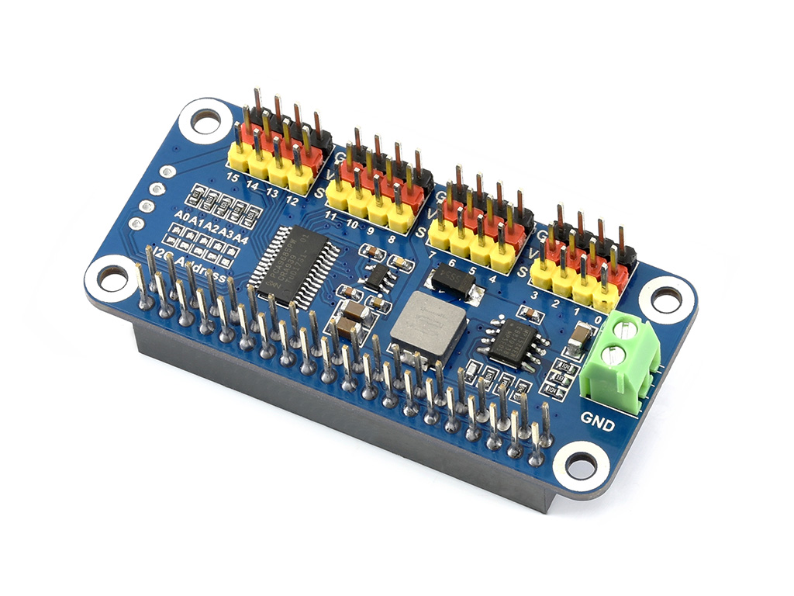</div> |


### Power Supply Components

- **Primary Battery:** 2S LiPo (7.4V, 2200mAh, 50C) with Deans connector
- **Raspberry Pi Power:** INIU 10,000mAh USB-C power bank (22.5W)
- **Voltage Regulation:** XL4005 DC-DC step-down converters
- **Current Distribution:** PCA9685 servo driver board

## Overall Circuit Usage <a class="anchor" id="overall-circuit-usage"></a>

Our power management strategy employs dual power domains:

1. **Control Domain:** Raspberry Pi powered by dedicated USB power bank
2. **Actuation Domain:** Motors and sensors powered by a LiPo battery

**Current Specifications:**

| Component      | Supply Voltage | Idle Current | Active Current | Peak Current |
| -------------- | -------------- | ------------ | -------------- | ------------ |
| Raspberry Pi 4 | 5.1V           | ~540mA       | ~1.0-1.3A      | up to 3.0A   |
| Camera Module  | 5V             | --           | ~200-250mA     | ~300-350mA   |
| ESP32          | 3.3V           | <5µA         | ~50-80mA       | ~120-200mA   |
| BNO086 IMU     | 3.3V           | ~3mA         | ~3-10mA        | --           |
| URM09 Sensors  | 5V             | --           | <20mA          | --           |
| MG996R Servo   | 6V             | ~10-20mA     | ~500-900mA     | ~2.0-2.5A    |
| Core DC Motor  | 6V             | --           | ~200-400mA     | ~2.2A        |

## Circuit Grounding <a class="anchor" id="circuit-grounding"></a>

Proper grounding ensures stable operation by providing a common electrical reference point for all components. Our star-grounding scheme minimizes electrical noise and prevents ground loops that could affect sensor readings.

## Power Supply <a class="anchor" id="power-supply"></a>

The separated power architecture prevents motor-induced voltage drops from affecting the Raspberry Pi, ensuring uninterrupted operation of the control system during high-current motor operations.

## Overall Scheme <a class="anchor" id="overall-scheme"></a>

<p align="center">
  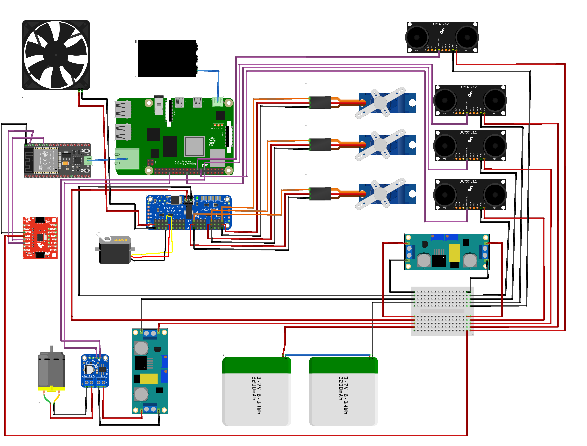
</p>

## Wiring Diagram <a class="anchor" id="wiring-diagram"></a>

<p align="center">
  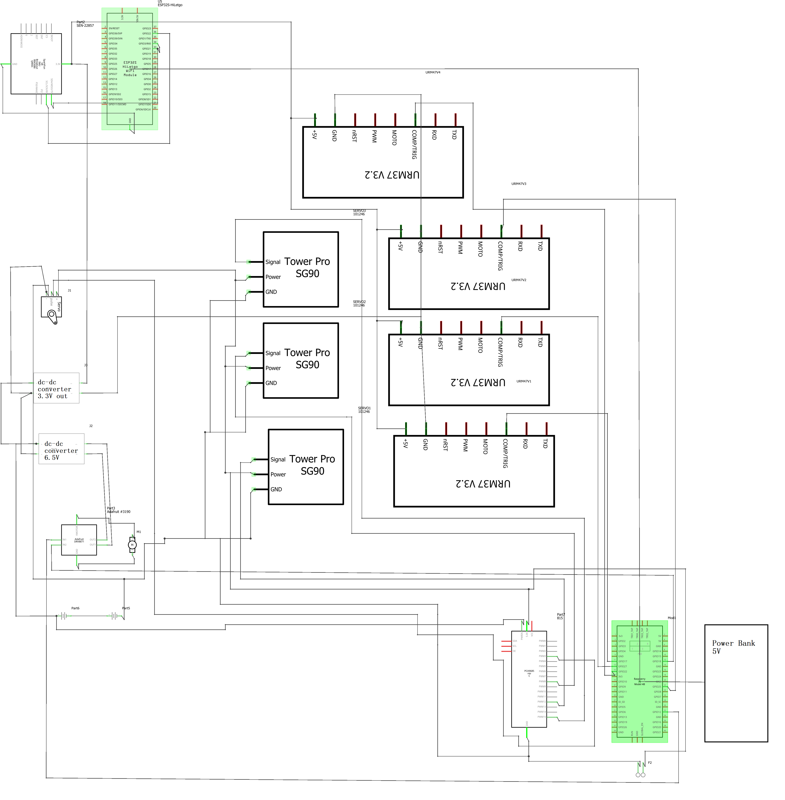
</p>

## Assembly List <a class="anchor" id="assembly-list"></a>

| Label    | Part Type        | Properties                           |
| -------- | ---------------- | ------------------------------------ |
| Mod1     | Raspberry Pi 4B  | BCM2711 Quad-core Cortex-A72 @1.5GHz |
| U5       | ESP32S-HiLetgo   | 38 pins, NudeMCU-32S variant         |
| Part2    | SparkFun BNO086  | VR IMU Breakout (Qwiic)              |
| Part3    | Adafruit DRV8871 | H-bridge motor driver                |
| Part7    | PCA9685          | PWM/Servo breakout board             |
| M1       | JSUMO Core Motor | 6V 400 RPM with 48:1 gearing         |
| J1       | TowerPro MG996R  | High-torque servo motor              |
| SERVO1-3 | TowerPro SG90    | Micro servo motors                   |
| URM1-4   | URM09            | Ultrasonic distance sensors          |
| Part4    | INIU Power Bank  | 10,000mAh USB-C in/out               |
| Part5-6  | LiPo Battery     | 2200mAh 2S configuration             |

## Shopping List <a class="anchor" id="shopping-list"></a>

| Qty       | Part                  | Unit Price (€) | Total (€)  |
| --------- | --------------------- | -------------- | ---------- |
| 1         | Raspberry Pi 4B (4GB) | 61.08          | 61.08      |
| 1         | ESP32 Dev Kit         | 11.49          | 11.49      |
| 1         | SparkFun BNO086       | 49.90          | 49.90      |
| 1         | Adafruit DRV8871      | 7.68           | 7.68       |
| 1         | PCA9685 Servo Board   | 40.79          | 40.79      |
| 1         | JSUMO Core Motor      | 12.50          | 12.50      |
| 1         | TowerPro MG996R       | 12.00          | 12.00      |
| 3         | TowerPro SG90         | 2.99           | 8.97       |
| 4         | URM09 Sensors         | 14.50          | 58.00      |
| 1         | Power Bank 10Ah       | 29.95          | 29.95      |
| 2         | LiPo 2200mAh          | 19.99          | 39.98      |
| 2         | XL4005 DC-DC          | 4.92           | 9.84       |
| 1         | Cooling Fan           | 1.99           | 1.99       |
| **Total** |                       |                | **343.77** |

# Obstacle Management <a class="anchor" id="obstacle-management"></a>

Our main algorithm for both challenges relies on the robot’s ability to move to a specified distance (threshold) from the inner or outer wall and then follow that offset to navigate between sections. We achieve this using ultrasonic sensors mounted on SG90 servos that rotate the sensors to face the wall, as shown in the following figure, providing accurate measurements of the robot’s distance on all four sides. To achieve that, we used an IMU sensor (BNO086) to estimate the robot’s angle during a run. Because we have multiple sensors, actuators, and controllers, our software stack is built with ROS Noetic (ROS 1) on Raspberry Pi OS Bookworm (ARM64), which handles real-time acquisition, synchronization, and processing of all sensor streams.

<p align="center">
  
</p>

## ROS Architecture <a class="anchor" id="ros-architecture"></a>

Our robot utilizes ROS Noetic for real-time sensor fusion and control:

**Node Structure:**

- **Control Node:** Central processing and decision making
- **Ultrasonic Node:** Range measurements at 25Hz
- **IMU Node:** Orientation data via rosserial bridge
- **Camera Node:** On-demand pillar detection service
- **Actuator Nodes:** Motor and servo command execution

**Communication:**

- Topics: `/ultra_sensors`, `/gyro_sensor`
- Services: `/detect_pillars` for vision processing
- Parameters: Dynamic reconfiguration for field tuning

## Open Challenge <a class="anchor" id="open-challenge"></a>

In the Open Challenge, the goal is to complete three laps without touching the walls and in the shortest possible time. We keep the robot centered in the lane by computing the difference between the right and left distance sensors and regulating this error toward zero during navigation. To improve the rate of change of this error, we also regulate the angle error—the difference between the current yaw (robot orientation) and the desired reference. This yields low overshoot when converging to the centerline and smooth motion transitions. To move to the next section, we detect corners using the side ultrasonic sensors, then adjust the desired robot angle reference by ±90° depending on the round direction.

### Navigation Strategy

We employ a dual-error PID controller that regulates the robot's angle and distances from the walls. The `pid_control` function shown below computes the distance error as the difference between the current and desired distances from the inner and outer walls, and the angle error as the difference between the current robot orientation and the desired reference angle. These errors are weighted by their respective proportional gains, kp1 and kp2, to generate a correction value at each control cycle. The final steering angle to be applied is then determined from this correction.

**Error Functions:**

```
e_θ(t) = wrap(θ(t)) - wrap(θ_ref)
e_d(t) = d_R(t) - d_L(t)
```

```python
def pid_control(kp1=0.5,kp2=-0.45,kd2=0,speed=max_speed,threshold=0,dists=[30]*4):
    #PID control loop to adjust steering and maintain distance balance.
    global prev_dist_err,steering, dist_err
    dist_err = dists[l] - dists[r]+threshold*dir1
    angle_err=yaw+float(dir1*sec*90)
    corr=kp1*(angle_err)+(kp2*(dist_err)+kd2*(dist_err-prev_dist_err))*(abs(dist_err)>0)
    
    # Limit correction to safe range
    corr = max(min(corr,25),-25)
    
    steering = steering_angle(corr)
    print(corr, steering)
    move_dc(speed,pi_pwm1,pi_pwm2)
```


**Corner Detection:**

```
max{d_L(t), d_R(t)} > d_corner ≈ 1.0m
```

When the robot reaches the twelfth section, it comes to a full stop based on calibrated distance readings from the front and rear ultrasonic sensors. This process is implemented in the code below.

```python
if sec == 12:
            msg.nums = [0.017,1,1,1]
            pub.publish(msg)
            dis = copy.deepcopy(dists)
            while dists[f]>150 or dists[b]<110:
                pid_control(speed = 80,dists = dis)
                dis = copy.deepcopy(dists)
            stop_dc(0.3)
            break
```

## Image Processing <a class="anchor" id="image-processing"></a>

Our algorithm depends on capturing five key images during the Obstacle Challenge to detect the colors of the pillars facing the robot. We capture one image as we exit the parking area at the start of the run and four images before each section. After collecting the required data from these images, processing is handled by a ROS service node; each time it is called, it returns a list of detected pillars with their attributes (area, centroid, and color).

### Camera Setup

 We adjust the properties of the camera to handle different lighting conditions as described in the following block.
 
 ```python
 # Initialize PiCamera2
        self.picam2 = Picamera2()
        config = self.picam2.create_preview_configuration(main={'size': (3072, 1792)})
        config['main']['format'] = 'RGB888'  # Use RGB color format
        config['controls']['ExposureTime'] = 20000  # Manual exposure
        config['controls']['AnalogueGain'] = 7      # Manual gain
        self.picam2.configure(config)
        self.picam2.start()
```

### Image Preprocessing

Before isolating the pillars to extract information, it is essential to apply preprocessing to the captured images. This step converts the image data into a form that helps us remove distracting elements that might be mistaken for pillars and identify the colors of objects in the game field, such as pillars and parking borders.

#### HSV Color Space Selection

We convert images from RGB to HSV so we can separate color from brightness. In RGB, each channel mixes chromatic information with luminance, so simple thresholds are very sensitive to lighting changes. HSV—Hue, Saturation, and Value—encodes, in order, the perceived color, its purity, and its brightness. This decoupling makes our color-based steps (masking, thresholding, segmentation) far more stable under shadows, glare, and exposure changes. Main advantages of using HSV are:

- **Lighting Independence:** Hue channel unaffected by illumination changes
- **Intuitive Filtering:** Easy threshold definition for color ranges
- **Robustness:** Better performance under varying environmental conditions

#### Masking

We use the following **Color Thresholds:**

- **Red Pillars:** Lower: [100, 43, 130], Upper: [141, 255, 255]
- **Green Pillars:** Lower: [30, 24, 90], Upper: [76, 213, 255]
- **Pink Parking:** Lower: [122, 87, 181], Upper: [134, 236, 255]


#### Contour Analysis

Contour detection in computer vision is the process of identifying the boundaries or edges of objects within an image. It is fundamental to many image analysis applications, including image segmentation, object recognition, and classification. The cv2 functions we used are mentioned in the following block.

```python
cv2.contourArea(contour)      # Object area calculation
cv2.boundingRect(contour)     # Bounding rectangle
cv2.moments(contour)          # Centroid computation
```

## Obstacle Challenge <a class="anchor" id="obstacle-challenge"></a>

In the Obstacle Challenge, the goal is to exit the parking lot, complete three laps with correct traversal of all pillars, and return to the parking lot without touching the walls and in the shortest possible time. Using ultrasonic and IMU sensors, the robot first leaves the parking area and navigates section by section. At each corner, the robot positions itself at the back-center of the corner section, where the camera system captures an image of the area. During the traversal of each section, the robot maintains a specified threshold from the inner or outer wall according to the detected pillar color and the round direction. It then passes all pillars in sequence while regulating its motion to ensure stable wall following and smooth transitions. After all pillars in a section are traversed, the robot moves to the back-center of the next corner and repeats the same process for the following sections. In the starting section containing the parking lots, the offset is shifted closer to the track center, preventing the robot from touching the parking borders.

### Pillar Detection

The following `pillar_detection_client` function implements the main algorithm for detecting the pillars and storing their data in global arrays. 

```python
def pillar_detection_client():
    """
    Call the 'pillar_detection' ROS service to detect pillars.
    Based on first section or later logic, filter or store the pillars list
    into pillars_array for further navigation decisions.
    """
    global check_pillar, first_section, first_section_color, pillars_array, far_cw_pillar
    if first_section == 0:
        # after the first section, wait and call the service
        rospy.wait_for_service('pillar_detection')
        try:
            pillar_detection = rospy.ServiceProxy('pillar_detection', PillarDetection)
            request = PillarDetectionRequest()
            response = pillar_detection(request)
            temp = []
            n = len(response.pillars)
            print(f'n: {n}')
            # Some filtering logic: if too many pillars or disparity is large or with background distance, prune
            if (n > 2) or ((response.pillars[n-1].distance - response.pillars[0].distance > value)
                           and response.pillars[0].distance + dists[b] < 90) \
               or (response.pillars[0].distance + dists[b] >= 90 and n == 2):
                m = 1 if n == 2 else 2
                for i in range(m):
                    temp.append(response.pillars[i])
            else:
                for i in range(n):
                    temp.append(response.pillars[i])
            pillars_array.append(temp)
        except rospy.ServiceException as e:
            print(f"Service call failed: {e}")
    else:
        # first section: simpler logic to decide if a pillar is present
        pillar_detection = rospy.ServiceProxy('pillar_detection', PillarDetection)
        request = PillarDetectionRequest()
        response = pillar_detection(request)
        # threshold distance depending on dir1
        di = 40 if dir1 == -1 else 90 
        if len(response.pillars) > 0:
            # if pillar is “far enough”, set check_pillar = 0 else 1
            check_pillar = 0 if response.pillars[0].distance > di else 1
            if di == 90 and response.pillars[0].distance > 40:
                far_cw_pillar = 1
            first_section = 0
            # record the color of the first pillar if in range
            first_section_color = response.pillars[0].color if response.pillars[0].distance < di else -1
        else:
            check_pillar = 0
            first_section = 0
        pillars_array.append([])
```

### Pillar Avoidance Strategy

**Threshold Selection:** Choose inner/outer wall bias based on pillar colors:

- Red pillars → Outer wall preference
- Green pillars → Inner wall preference
  **Sequential Navigation:** Clear pillars one by one using ultrasonic feedback

The `pid_control` function maintains the desired thresholds while passing pillars.

```python
def pid_control(kp1=0.5, kp2=-0.75, kd2=0, speed=max_speed,
                threshold_dist=15, threshold_angle=0,
                sens=outer, dists=[15,15,15,15]):
    """
    PID-like control combining angular and distance corrections.
    - sens: which sensor (outer, inner, etc.) to use for lateral distance error.
    - threshold_dist: target distance from that sensor side.
    - threshold_angle: desired yaw offset.
    - kp1 handles angular (yaw) error, kp2 handles distance error.
    Sets steering by converting corr → steering angle, and moves DC motor.
    """
    global prev_dist_err, steering, dist_err
    # compute lateral distance error (positive or negative depending on side)
    dist_err = (dists[sens] - threshold_dist) if sens == l else (-dists[sens] + threshold_dist)
    
    angle_err = yaw + float(dir1 * sec * 90) - threshold_angle
    # if yaw error too large, we suppress correction gain
    if abs(yaw + float(dir1 * sec * 90)) > 60:
        kp2 = 0
    
    corr = (kp1 * (angle_err)
            + (kp2 * (dist_err) + kd2 * (dist_err - prev_dist_err)) * (abs(dist_err) > 0))
    # bound corr
    if corr > 25:
        corr = 25
    elif corr < -25:
        corr = -25
    steering = steering_angle(corr)
    move_dc(speed, pi_pwm1, pi_pwm2)
```

<p align="center">
  
  &nbsp;&nbsp;
  
  </p>

### Performing parallel parking

After completing all sections, the robot performs a parallel-parking maneuver in the designated spot using the final distance to the outer wall and the robot angle as references. Once properly aligned, the robot comes to a full stop, marking the end of the round. 

The `parking` function imitates the real-world cars' movements to perform parallel parking.

```python
def parking():
    """
    The final parking maneuver. Reverse, steer, and align in the parking slot.
    """
    global steering
    steering = min_steering * (dir1 == -1) + max_steering * (dir1 == 1)
    while abs(yaw + float(dir1 * sec * 90)) < 40:
        move_dc(-60, pi_pwm1, pi_pwm2)
    steering = 0
    stop_dc(0, 0.3)
    while dists[inner] < 68:
        move_dc(-60, pi_pwm1, pi_pwm2)
    steering = max_steering * (dir1 == -1) + min_steering * (dir1 == 1)
    stop_dc(0, 0.3)
    while dists[outer] > 5 and dists[b] > 10:
        pid_control(kp1=-3, kp2=0, kd2=0, speed=-60, threshold_dist=3, threshold_angle=0)
    d = dists[outer]
    while dists[inner] < 82 or abs(yaw + float(dir1 * sec * 90)) > 3:
        prevTime = time.time()
        while dists[f] < 15 and (dists[inner] < 82 or abs(yaw + float(dir1 * sec * 90)) > 3) and time.time() - prevTime < 0.25:
            move_dc(-50, pi_pwm1, pi_pwm2)
            steering = min_steering * (dir1 == -1) + max_steering * (dir1 == 1)
        prevTime = time.time()
        while dists[f] < 15 and (dists[inner] < 82 or abs(yaw + float(dir1 * sec * 90)) > 3):
            move_dc(-50, pi_pwm1, pi_pwm2)
            steering = max_steering * (dir1 == -1) + min_steering * (dir1 == 1)
        thresh = dists[inner] + 0.5
        dis = copy.deepcopy(dists)
        while dists[f] > 7 and (dists[inner] < 82 or abs(yaw + float(dir1 * sec * 90)) > 3):
            pid_control(kp1=2, kp2=0, speed=50)
            dis = copy.deepcopy(dists)
    while dists[f] < 12:
        pid_control(kp1=-1.5, kp2=0, kd2=0, speed=-50, threshold_angle=0)
        flag = 1
    while dists[f] > 12:
        pid_control(kp1=1.5, kp2=0, kd2=0, speed=50, threshold_angle=0)
        flag = -1
    stop_dc(flag * 50, 0.1)
    steering = 0
```
  
## Problems We Encountered <a class="anchor" id="problems-we-encountered"></a>

### Wave Interference

**Issue:** Interference of ultrasonic sensors when operating simultaneously
**Solution:** Sequential sensor activation - alternating between opposite sides (R1+L2, then R2+L1, then F+B)

### Mechanical Limitations

**Issue:** Small turn angles and wheel slipping without a differential
**Solution:** Implemented a Lego differential gear system for smooth turning

### Camera Flickering

**Issue:** Brightness fluctuations in video stream
**Solution:** Manual shutter speed control: `picam2.set_controls({"ExposureTime": shutter_speed})`

### Real-Time Performance

**Issue:** Synchronizing multiple sensor streams
**Solution:** ROS middleware with timestamped messages and configurable update rates

# Suggestions and Future Modifications <a class="anchor" id="suggestions-and-future-modifications"></a>

## Mobility Management

### Mechanical Upgrades

- **Metal Differential:** Replace Lego components with metal differential and axles
- **Robust Coupling:** Metal motor-to-axle adapter for improved reliability
- **Enhanced Bearings:** Low-friction bearings for smoother operation

## Power and Sense Management

### Sensor Improvements

- **Direct IMU Integration:** Connect BNO086 directly to Raspberry Pi I2C
- **ToF Sensors:** Upgrade from ultrasonic to VL53L1X Time-of-Flight sensors
- **LiDAR Integration:** Consider RPLIDAR A1 for 360° obstacle detection

### Power Management

- **Battery Management System:** Implement BMS for cell monitoring and protection
- **Custom PCB:** Design an integrated board for robust connections and clean wiring
- **Thermal Management:** Enhanced cooling for sustained operation

## Computer Vision

### Hardware Upgrade

- **Depth Camera:** Intel RealSense D435 for accurate distance measurement
- **Wider FOV:** Improved peripheral vision for obstacle detection

### Software Optimization

- **Persistent Mapping:** Cache pillar configurations after first lap
- **Path Optimization:** Direct section-to-section navigation on subsequent laps
- **Advanced Algorithms:** Machine learning for improved pillar classification

## System Integration

### Performance Enhancements

- **Real-Time OS:** Consider RT kernel for deterministic timing
- **Sensor Fusion:** Advanced Kalman filtering for state estimation
- **Predictive Control:** Model predictive control for optimal path planning

# Resources <a class="anchor" id="resources"></a>

## Technical Documentation

- [WRO 2025 Future Engineers Rules](https://wro-association.org/wp-content/uploads/WRO-2025-Future-Engineers-Self-Driving-Cars-General-Rules.pdf)
- [ROS Noetic Documentation](http://wiki.ros.org/noetic)
- [OpenCV HSV Color Space](https://docs.opencv.org/3.4/da/d97/tutorial_threshold_inRange.html)

## Component Datasheets

- [Raspberry Pi 4 Model B](https://www.raspberrypi.org/products/raspberry-pi-4-model-b/)
- [ESP32-WROOM-32E](https://www.espressif.com/sites/default/files/documentation/esp32-wroom-32e_esp32-wroom-32ue_datasheet_en.pdf)
- [BNO086 IMU](https://cdn.sparkfun.com/assets/1/3/4/5/9/BNO086_Datasheet.pdf)
- [DRV8871 Motor Driver](https://www.ti.com/lit/ds/symlink/drv8871.pdf)

## Open Source Libraries

- [rosserial](http://wiki.ros.org/rosserial) - Arduino/ESP32 to ROS bridge
- [OpenCV](https://opencv.org/) - Computer vision processing
- [SH-2 Reference Manual](https://www.ceva-dsp.com/wp-content/uploads/2019/10/BNO080_085-Datasheet.pdf)

---

## Copyright

```
MIT License

Permission is hereby granted, free of charge, to any person obtaining a copy of this software and associated documentation files (the "Software"), to deal in the Software without restriction, including without limitation the rights to use, copy, modify, merge, publish, distribute, sublicense, and/or sell copies of the Software, and to permit persons to whom the Software is furnished to do so, subject to the following conditions:

The above copyright notice and this permission notice shall be included in all copies or substantial portions of the Software.

THE SOFTWARE IS PROVIDED "AS IS", WITHOUT WARRANTY OF ANY KIND, EXPRESS OR IMPLIED, INCLUDING BUT NOT LIMITED TO THE WARRANTIES OF MERCHANTABILITY, FITNESS FOR A PARTICULAR PURPOSE AND NONINFRINGEMENT. IN NO EVENT SHALL THE AUTHORS OR COPYRIGHT HOLDERS BE LIABLE FOR ANY CLAIM, DAMAGES OR OTHER LIABILITY, WHETHER IN AN ACTION OF CONTRACT, TORT OR OTHERWISE, ARISING FROM, OUT OF OR IN CONNECTION WITH THE SOFTWARE OR THE USE OR OTHER DEALINGS IN THE SOFTWARE.

© 2025 SQ-391 Team
```
